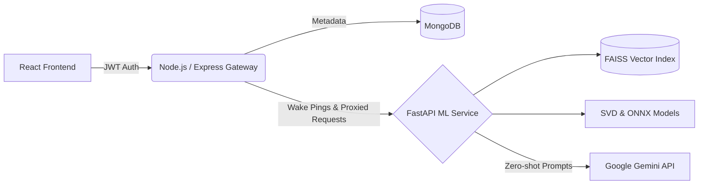

<div align="center">
  <h1>📚 StoryNest</h1>
  <p><strong>AI-Powered Hybrid Book Recommendation Engine</strong></p>
  
  [](https://nodejs.org/)
  [](https://reactjs.org/)
  [](https://fastapi.tiangolo.com/)
  [](https://www.mongodb.com/)
  [](https://onnxruntime.ai/)
</div>

<br/>

StoryNest is a full-stack, enterprise-grade recommendation system that goes beyond simple keyword matching. By combining **Collaborative Filtering (SVD)** with deep **Natural Language Processing (Transformers)**, StoryNest understands the actual *themes and vibes* of the books you read, delivering hyper-personalized recommendations with sub-millisecond latency.

---

## 📖 Deep Dive Documentation

This README provides a quick overview. For in-depth technical analysis, architecture decisions, and machine learning math, please see our dedicated documentation:

* 🧠 **[The Machine Learning Engine Explained](./docs/ML_EXPLAINED.md)**
  * *A 12-chapter mini-textbook explaining our vector spaces, Cosine Similarity, the `all-MiniLM-L6-v2` transformer, FAISS `IndexFlatIP`, and the math behind our 5-signal Hybrid Formula.*
* 🏗️ **[Project Architecture & Documentation](./PROJECT_DOCUMENTATION.md)**
  * *Detailed backend architecture, API proxy routing, artifact management, and database schemas.*

---

## ✨ Core Features

* **Hybrid Recommendation Engine:** Blends 5 unique signals (Content Similarity, Collaborative SVD, Favourites Boost, Ratings Boost, and Explicit Feedback) to score 10,000 books in real-time.
* **Vector Semantic Search:** Don't know the title? Search by vibe. (e.g., *"space battles with aliens"*). StoryNest uses FAISS to find books conceptually close to your query.
* **Gemini AI Explanations:** Click **"Ask AI Why"** on any recommendation. The backend dynamically injects your closest historical reads into a prompt, and Google Gemini explains *exactly* why the math recommended it to you.
* **Cold-Start Resilience:** New users immediately inherit a "proxy" identity based on their onboarding choices, completely bypassing the traditional collaborative filtering cold-start problem.
* **Memory-Optimized Deployment:** Stripped of heavy PyTorch dependencies, the ML microservice uses the **ONNX Runtime** (via FastEmbed) to execute transformer inference within a strict 512MB RAM cloud limit.

---

## 🏗️ Architecture Stack

StoryNest uses an **API Gateway Proxy Pattern** to keep the Machine Learning layer secure and strictly isolated from the public internet.



---

## 🚀 Quick Start (Local Development)

### Prerequisites
- **Node.js** ≥ 18
- **Python** ≥ 3.10
- **MongoDB** running locally on port 27017

### 1. The Machine Learning Microservice (FastAPI)
```bash
cd ml-service
pip install -r requirements.txt

# Create a .env file and add your Gemini key (Optional but recommended)
echo "GEMINI_API_KEY=your_key_here" > .env

python main.py
# Running on http://localhost:8000
```

### 2. The API Gateway (Node.js/Express)
```bash
cd server
npm install
npm run dev
# Running on http://localhost:5000
```

### 3. The Frontend (React/Vite)
```bash
cd client
npm install
npm run dev
# Running on http://localhost:5173
```

---

## 💡 Usage Flow

1. **Register:** Create an account on the modern glassmorphism auth page.
2. **Onboard:** Select at least 3 books you've enjoyed from the onboarding grid. (This maps you to an SVD Proxy).
3. **Dashboard:** Your personalized recommendations load dynamically. The ML server wakes up in the background while you browse Random Picks.
4. **Discover:** Search for books semantically, rate them, or add them to your favorites list to instantly shift your recommendation vectors.
5. **Ask AI:** Click "Ask AI Why" to see the mathematical and thematic link between your history and your new recommendation.

<br/>
<div align="center">
  <i>Engineered for the love of reading and machine learning.</i>
</div>
