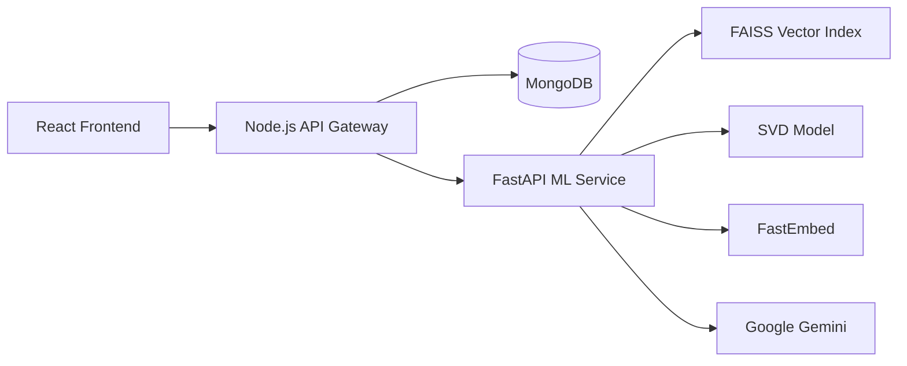

<div align="center">

# 📚 StoryNest

### AI-Powered Hybrid Book Recommendation Platform

<p>
A full-stack recommendation system that combines <b>Collaborative Filtering</b>, <b>Semantic Search</b>, and <b>Large Language Models</b> to deliver highly personalized book recommendations.
</p>

[](https://nodejs.org/)
[](https://reactjs.org/)
[](https://fastapi.tiangolo.com/)
[](https://www.mongodb.com/)
[]()
[]()

</div>

---

# 📖 About

StoryNest is a modern full-stack AI-powered book recommendation platform built using a microservice architecture.

Instead of relying only on keywords or popularity, StoryNest combines multiple recommendation techniques including **Collaborative Filtering (SVD)**, **Content-Based Filtering**, **Vector Similarity Search (FAISS)**, and **Google Gemini** to understand both **what books users enjoy** and **why they enjoy them**.

The system continuously personalizes recommendations using:

- Reading History
- Ratings
- Favorites
- Reading Status
- Explicit User Feedback (👍 / 👎)

The result is a recommendation engine that evolves with every interaction.

---

# 📚 Documentation

This README provides an overview of the project.

For a complete technical breakdown, see:

- 🧠 **[Machine Learning Explained](./docs/ML_EXPLAINED.md)**
  - Vector Embeddings
  - Transformers
  - FastEmbed
  - FAISS
  - Semantic Search
  - Hybrid Recommendation Formula
  - Recommendation Pipeline

- 🏗 **[Project Architecture](./PROJECT_DOCUMENTATION.md)**
  - Backend Architecture
  - Database Design
  - API Gateway
  - Artifact Generation
  - Deployment Optimizations
  - Memory Optimizations
  - Cloud Architecture

---

# ✨ Features

## 🤖 AI Recommendation Engine

- Hybrid Recommendation Engine combining multiple recommendation signals
- Collaborative Filtering using Singular Value Decomposition (SVD)
- Content-Based Recommendations using Transformer Embeddings
- Personalized Ranking using:
  - Reading History
  - Ratings
  - Favorites
  - Reading Status
  - User Feedback
- Cold-start handling through Proxy User Matching

---

## 🔍 Search

### Keyword Search

Search books by title or author using MongoDB text search.

### Semantic Search

Search naturally using phrases like:

> "magic school"

> "space battles with aliens"

> "psychological mystery"

The query is converted into vector embeddings using **FastEmbed (all-MiniLM-L6-v2)** and matched against the FAISS vector index.

### AI Search

Describe books naturally.

Example:

> "I want a fantasy book with dragons, politics and slow romance."

Google Gemini extracts the semantic intent from the request before performing semantic retrieval.

---

## 📖 Personalized Experience

- Reading History
- Favorites
- Ratings
- Reading Status
- Similar Books
- AI Explanations
- Recommendation Refresh
- Responsive Dashboard
- Mobile & Desktop Optimized UI

---

## 🧠 AI Explanations

Every recommendation includes an optional **Ask AI Why** feature.

The backend first identifies the most relevant books from the user's reading history using semantic similarity.

Those books, together with the recommended book, are passed to **Google Gemini**, which generates a concise explanation describing the thematic relationship.

---

## ⚡ Performance Optimizations

- Thread-safe Lazy Loading
- FastEmbed (ONNX Runtime)
- FAISS Vector Index
- Memory Optimized Artifact Loading
- Fast Cold Starts
- API Gateway Pattern
- Optimized Cloud Deployment for Render Free Tier

---

# 🏗 Architecture

StoryNest follows an API Gateway architecture where the frontend never communicates directly with the Machine Learning service.



---

# 🚀 Tech Stack

### Frontend

- React
- Vite
- Tailwind CSS

### Backend

- Node.js
- Express.js
- JWT Authentication
- MongoDB

### Machine Learning

- FastAPI
- scikit-surprise (SVD)
- FastEmbed
- FAISS
- NumPy
- Google Gemini

---

# 🚀 Local Setup

## ML Service

```bash
cd ml-service

pip install -r requirements.txt

python main.py
```

Runs on:

```
http://localhost:8000
```

---

## Backend

```bash
cd server

npm install

npm run dev
```

Runs on:

```
http://localhost:5000
```

---

## Frontend

```bash
cd client

npm install

npm run dev
```

Runs on:

```
http://localhost:5173
```

---

# 💡 User Journey

1. Register an account.
2. Complete onboarding by selecting books you enjoy.
3. A proxy user initializes collaborative recommendations.
4. Browse personalized recommendations.
5. Search using keywords, semantic search, or AI search.
6. Rate books, add favorites, update reading status, and provide feedback.
7. Recommendations continuously adapt based on your interactions.
8. Click **Ask AI Why** to understand the reasoning behind any recommendation.

---

<div align="center">

Built with ❤️ using React, FastAPI, Node.js, MongoDB, FAISS, FastEmbed, and Google Gemini.

</div>
